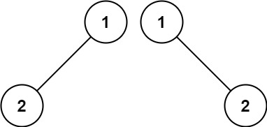

# 100. Same Tree
Difficulty: Easy

[Link To Leetcode Problem](https://leetcode.com/problems/same-tree/)

## Problem
Given the roots of two binary trees `p` and `q`, write a function to check if they are the same or not.

Two binary trees are considered the same if they are structurally identical, and the nodes have the same value.

## Examples
### Example 1:

```
Input: p = [1,2,3], q = [1,2,3]
Output: true
```
### Example 2:

```
Input: p = [1,2], q = [1,null,2]
Output: false
```
### Example 3:

```
Input: p = [1,2,1], q = [1,1,2]
Output: false
```

## Constraints:
- The number of nodes in both trees is in the range `[0, 100]`.
- `-10^4 <= Node.val <= 10^4`