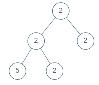

# 965. Univalued Binary Tree
Difficulty: Easy

[Link To Leetcode Problem](https://leetcode.com/problems/univalued-binary-tree/)

## Problem
A binary tree is **uni-valued** if every node in the tree has the same value.

Given the `root` of a binary tree, return `true` *if the given tree is **uni-valued**, or* `false` *otherwise.*

## Examples
### Example 1:

```
Input: root = [1,1,1,1,1,null,1]
Output: true
```
### Example 2:

```
Input: root = [2,2,2,5,2]
Output: false
```

## Constraints:
- The number of nodes in the tree is in the range `[1, 100]`.
- `0 <= Node.val < 100`